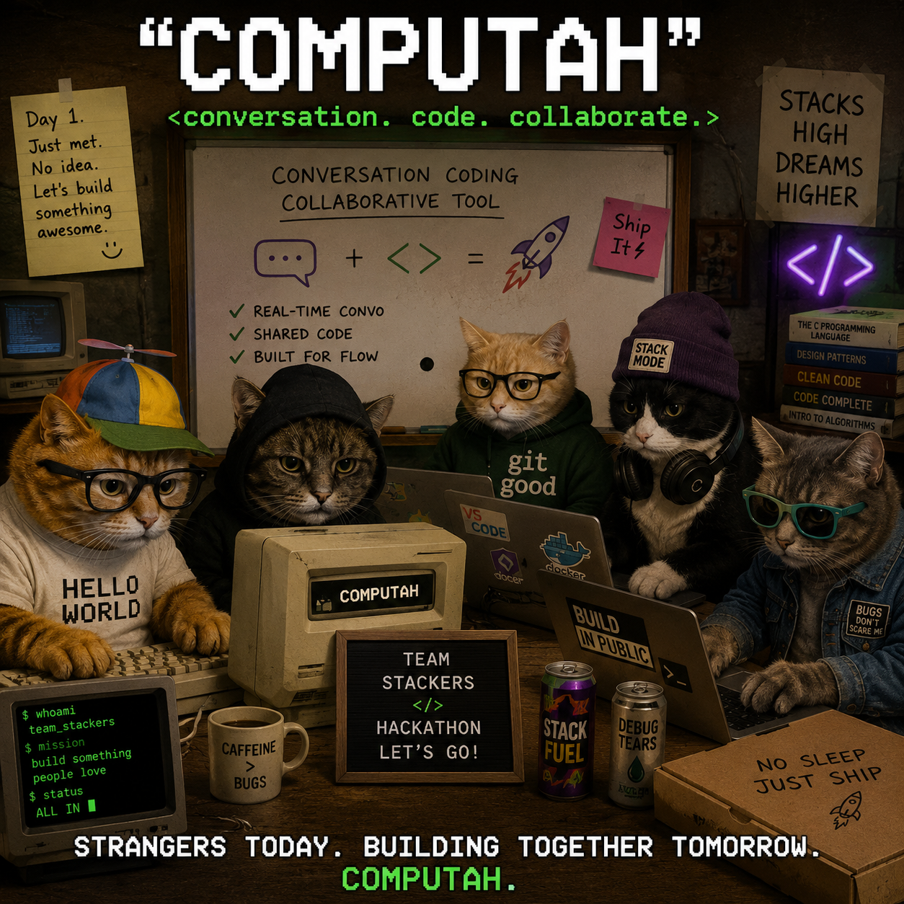

# Computah 🖥️

**Platform-agnostic collaborative coding agents.**

🌐 **Live:** [computah-mu.vercel.app](https://computah-mu.vercel.app)

Computah brings people together to drive coding agents — from whatever platform
they already talk on. Create a project in the web app, join its chat channel, then
connect **Discord** channels, **Slack** servers (and soon **Maskord**) as
source/destination platforms: every message flows into one shared conversation
that steers the agents, and the agents report back to every connected channel.

The pieces:

- **Web app** ([computah-mu.vercel.app](https://computah-mu.vercel.app)) — create a
  project, join its chat channel, connect external platforms *(in progress —
  currently the verification console)*
- **Messaging bridge** — Composio-powered ingestion: Discord/Slack messages land
  in a unified `platform_messages` inbox that drives the agents
- **Voice app** (`voice-app/`, Electron) — always-listening transcription that
  turns spoken conversation into agent-driving signal, the same way
- **Verification engine** — agents check their own work: Computah opens the
  change in a *real* browser, drives it like a QA tester toward a plain-English
  goal, watches for console errors, and returns a **PASS/FAIL verdict the agent
  can act on** — closing the build → test → fix loop without a human

Built for the **InsForge Agentic Dev Tools Hackathon**. The entire backend runs on InsForge:

| InsForge primitive | What Computah uses it for                                |
| ------------------ | -------------------------------------------------------- |
| **AI**             | Reads a text snapshot of the page → drives + judges it   |
| **Storage**        | Per-step screenshots (`computah-shots` bucket) for replay |
| **Postgres**       | Verification sessions (`verifications`), the cross-platform message inbox (`platform_messages`), and the voice app's `sessions` / `transcript_segments` / `memories` |

```
Coding agent (Claude Code / Cursor / Devin)
      │  MCP tool: computah_verify({ url, goal })
      ▼
Computah MCP server ──HTTP──► Next.js /api/verify
                                   │
              ┌────────────────────┼─────────────────────┐
              ▼                    ▼                      ▼
     Playwright (Chromium)   InsForge AI          InsForge Storage + DB
   open · click · type ·   look at screenshot,   screenshots + full
   screenshot each step    pick next action,     session for replay
                           judge the goal
                                   │
                                   ▼
                      Dashboard: live session replay + verdict
```

## The demo

> You say, out loud: *"Spin up an agent to build a Tetris game."*
> → Your words stream into the live transcript **and replicate instantly to the
> team's Discord channel** — everyone sees it, wherever they are.
> → Computah's AI extracts the build instruction and pops a **replicant card**.
> → One click on **Approve** → a real cloud coding agent ([Replicas](https://tryreplicas.com))
> boots in its own VM and starts building, committing to a branch and opening a PR.
> → When the agent says it's done, Computah opens the change in a *real* browser,
> drives it like a QA tester, and posts the **PASS/FAIL verdict back to every
> connected channel**.
>
> Conversation in. Working, verified software out. From any platform.

## The team

Built by **Team Stackers** at the **InsForge Agentic Dev Tools Hackathon** —
strangers on day 1, shipping by day's end.



| | |
| --- | --- |
| **Abhishek Jani** | [LinkedIn](https://www.linkedin.com/in/abhishek-jani-97b8781a7/) |
| **Seth Caldwell** | [LinkedIn](https://www.linkedin.com/in/sethinsd) |
| **Abir Biswas** | [LinkedIn](https://www.linkedin.com/in/abir-biswas/) |
| **Pranav Uppiliappan** | [LinkedIn](https://www.linkedin.com/in/pranav-uppiliappan/) |
| **Ayush Jain** | [LinkedIn](https://www.linkedin.com/in/ayush-jain-uiuc) |

## How we used the sponsors

| Sponsor | What it powers |
| --- | --- |
| **InsForge** | The **entire backend**, operated by agents via CLI throughout the build: Google/GitHub auth with row-level security, 9 Postgres tables under migrations, **realtime** (a DB trigger pushes every message to `hub:%` channels the web chat subscribes to), the AI model gateway (voice-command extraction + browser-verification judging), and Storage (verification screenshots). |
| **Replicas** | The **replicants themselves** — every approved card spawns a real cloud coding agent in its own VM via the Replicas API, prompted to commit on a branch and open a PR. Per-project API keys/environments live in project settings. |
| **lim.run** | Built and tested the **native mobile** version of the voice app (`voice-app/mobile`) — no Mac required. |
| **Composio** | OAuth + tool execution for the messaging layer — Slack next, **Maskord** when it lands. |
| **Anthropic** | Claude (Agent SDK + Claude Code) as the coding agent behind the replicants and the build itself. |
| **Deepgram** | Real-time transcription in the desktop voice app (per-project keys in settings). |
| **HeyGen** | The landing-page product video is a HyperFrames composition (`promo/`), rendered to MP4. |
| **Memoir** | Posted about the project on X and LinkedIn. |
| **Vercel** | Hosts the live app at [computah-mu.vercel.app](https://computah-mu.vercel.app). |

## The judging criteria, addressed

**Originality (25%)** — You can *talk a coding agent into existence* — from Discord,
from your browser, or just out loud — and the whole team watches it happen from
whichever platform they already live in. The unexpected part isn't any one piece;
it's that the conversation itself is the interface: every message **replicates
bidirectionally** across web ↔ voice ↔ Discord, that shared context drives the
agents, and the agents verify their own work in a real browser before reporting
back everywhere. We haven't seen "platform-agnostic collaborative agent-driving"
anywhere else.

**Technical execution (20%)** — It works end-to-end, today: Discord Gateway
websockets in (instant), InsForge realtime push to the browser (instant),
loop-prevention on relays, dedup on replays, RLS on every table, OAuth with code
verification, replicants with live status polling, and a one-time backfill so no
message is ever lost. 9 migrations, all applied; the build is green; the demo
runs on the live pipeline, not a mock.

**Demo impact (20%)** — The demo is a sentence: *"spin up an agent to build a
Tetris game"* — spoken into the room. The room watches it appear in Discord,
become a card, become a **running cloud agent**, and come back as a verified PR.
The audience can post in the Discord channel mid-demo and watch their own words
land in the app in under a second.

**Sponsor tool use (15%)** — All three judged sponsors are **load-bearing**, not
decorative: InsForge *is* the backend (auth, Postgres, realtime, AI gateway,
storage — see table above), Replicas *is* the product's core verb (spawning
replicants), and lim.run built the mobile surface. Remove any one and a feature
disappears.

**Ambition (10%)** — One day, five strangers: a web platform with auth + RLS, a
bidirectional cross-platform message replicator, voice-driven agent spawning, an
Electron always-listening app, a lim.run mobile app, a self-verifying browser
agent with MCP, and a HyperFrames-rendered promo. We swung.

**Personal preference (10%)** — This is the tool we wanted while building it:
the team coordinated in Discord all day — if Computah had existed at 9am, our
Discord chatter would have been spawning the agents that built Computah.
Recursive? That's the roadmap.

## Setup

1. **InsForge project.** Create one at [insforge.dev](https://insforge.dev) (or self-host).
   Grab the **Base URL** and **Admin API key**.

2. **Schema + bucket.** In the InsForge SQL editor run [`scripts/schema.sql`](scripts/schema.sql),
   then create a **public** storage bucket named `computah-shots`.

3. **Env.** Copy `.env.example` → `.env.local` and fill it in:
   ```bash
   cp .env.example .env.local
   ```

4. **Install + run.**
   ```bash
   npm install
   npx playwright install chromium   # local browser
   npm run dev                       # http://localhost:3000
   ```

Open http://localhost:3000, pick an example, and hit **Verify**.

## Use it from a coding agent (MCP)

Run the MCP server (it calls the Computah app over HTTP):

```bash
npm run mcp
```

Register it with your agent. For **Claude Code** (`.mcp.json`):

```jsonc
{
  "mcpServers": {
    "computah": {
      "command": "npx",
      "args": ["tsx", "mcp/server.ts"],
      "env": { "COMPUTAH_URL": "http://localhost:3000" }
    }
  }
}
```

Then your agent can call:

```
computah_verify({
  url: "http://localhost:3000/login",
  goal: "Log in with test@test.com / password and land on /dashboard"
})
```

It returns a verdict, the console errors, and a replay link.

## Deploy (Vercel)

The dashboard + API deploy to Vercel. Playwright on serverless uses
`@sparticuz/chromium` (auto-selected when `VERCEL=1`). Set the same env vars in the
Vercel project.

```bash
vercel --prod
```

For heavier browser workloads, point `/api/verify` at a dedicated browser worker — the
engine in `src/lib/verify.ts` is transport-agnostic.

## Layout

```
src/lib/insforge.ts        InsForge admin client (DB · Storage · AI)
src/lib/verify.ts          The verification engine (Playwright agent loop)
src/app/api/verify         POST → run a verification
src/app/api/sessions       GET  → list / fetch sessions
src/app/page.tsx           Run console + recent sessions
src/app/sessions/[id]      Session replay player
mcp/server.ts              MCP tool: computah_verify
scripts/schema.sql         InsForge table definition (verifications)
migrations/                InsForge migrations (platform_messages inbox)
scripts/composio-discord-listen.mts
                           Composio bridge: Discord channel → platform_messages
voice-app/                 Electron voice app (submodule): speech → transcript → memories
```

## Roadmap

- [ ] Projects + chat channels in the web app (create a project, invite people, talk to the agents)
- [ ] Discord/Slack channel linking from the UI (the Composio bridge already lands messages in `platform_messages`)
- [ ] Outbound fan-out: agent + human messages broadcast to every connected platform
- [ ] Maskord support when it lands on Composio
- [ ] Fold the voice app into the same project/channel model
